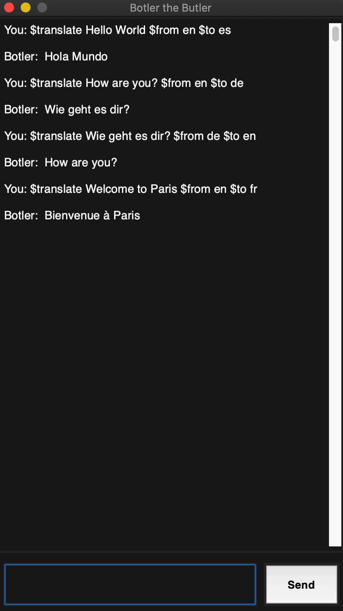
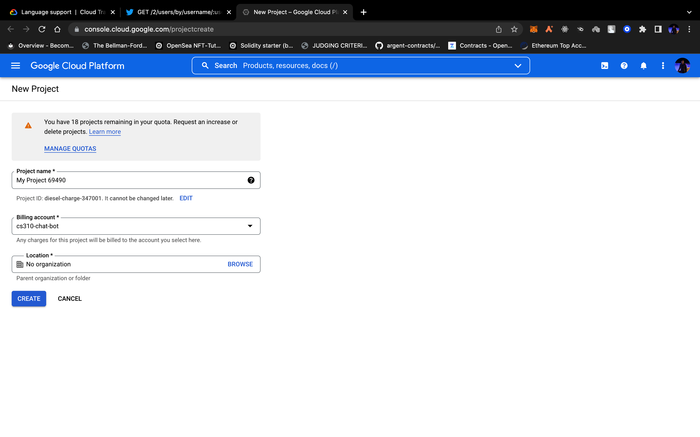
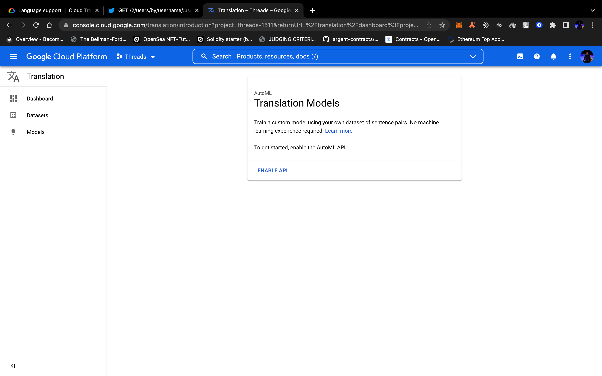
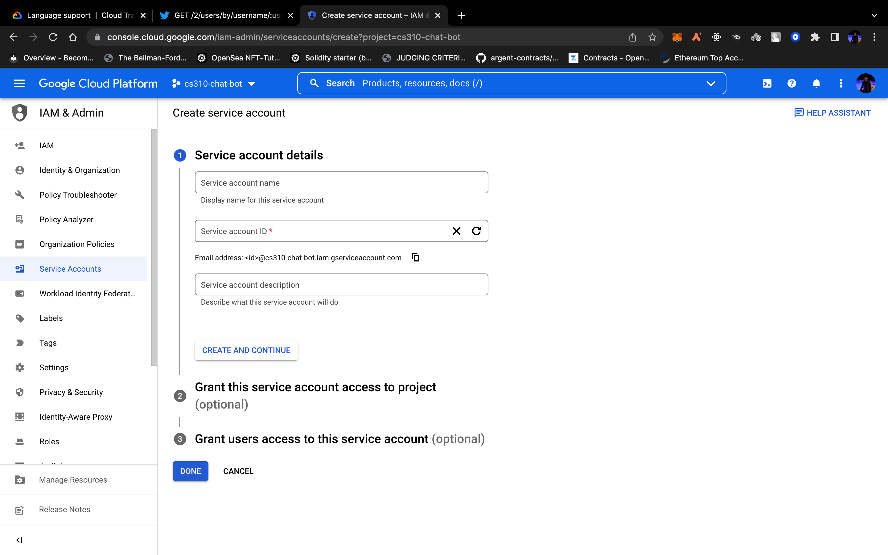
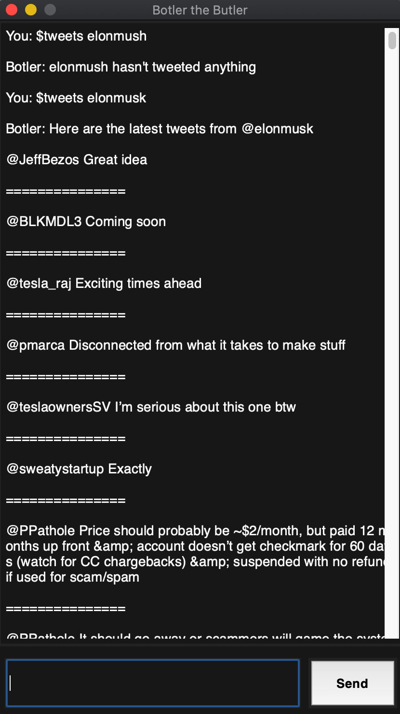
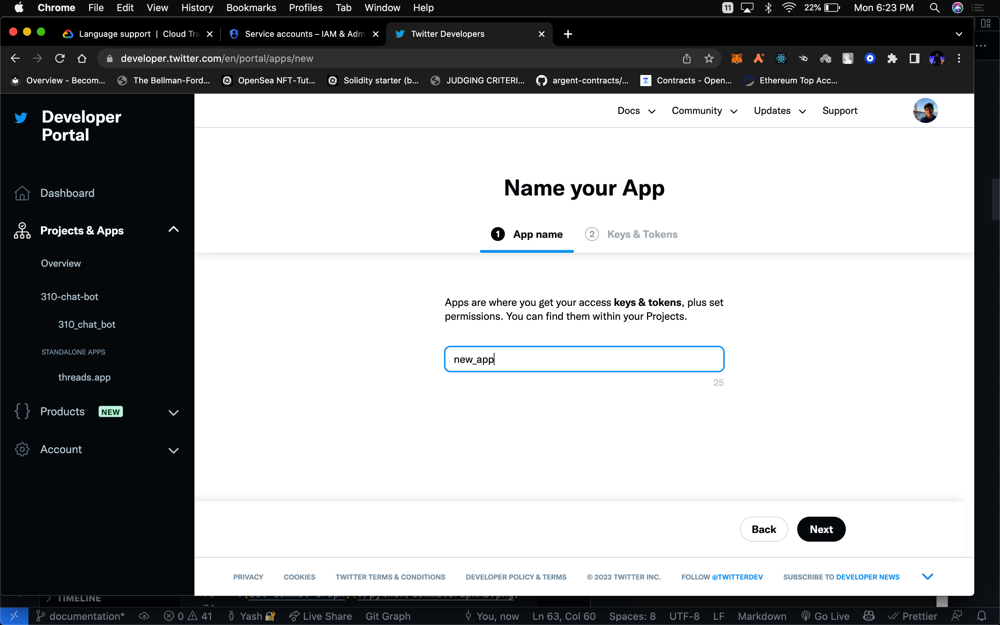
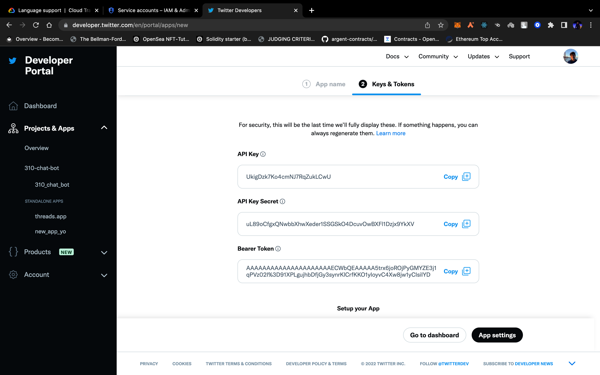

# M.A.A.M.Y's Chat Bot
Software Engineering Term 2, 2022

Our group has decide to create a chatbot using python. We have used the <a href="https://www.nltk.org/" target="_blank">***NLTK***</a> python Library in order to create our chatbot. The bot will be taking the role of a sassy, well educated, butler with a good scence of humour, meanwhile the user will take the role of its master.

In A3 we have made significant in terms of user experience with new GUI and also technical improvements in the conversation flow with help of sentiment analysis and autocorrect for spelling mistakes, which was not possible in our previous A2 version of the bot.

As we promised in the A2 version, "Future revisions and additions could improve versatility", we have delivered on that promise.

You can find a list of the features and improvements in A3 [here](#a3-features-and-improvements).

The MIT liscence is in this same direcory and is named <a href="https://github.com/Software-Engineering-Group-4-Maamy/chat-bot/blob/main/LICENSE" target="_blank">LICENSE</a>.

## Installation guide
1. First, install <a href="https://pip.pypa.io/en/stable/installation/">pip</a> if you have not already
2. Clone this git repository, or download the zip file.
3. Run `pip3 install nltk google-cloud-translate requests`
4. Inside the python directory, run the main.py file `python3 main.py`
5. Vouala - you now own a human soul.

## Integrated API's

1. [Google Translate API](https://cloud.google.com/translate)

Using the Google Translate API, we can translate text from one language to another.

Usage:

``` $translate <text> $from <language code> $to <language code> ```

Language codes can be found [here](https://cloud.google.com/translate/docs/languages).

Example Output:



Integration steps:

- [Create](https://console.cloud.google.com/projectcreate) a Google Cloud Platform project.



- [Enable](https://console.cloud.google.com/translation/introduction) the translation API.



- [Create a service account](https://console.cloud.google.com/iam-admin/serviceaccounts/create) like ```serviceAccount-chat-bot.json```, and give it the role: ```Translation API user```. This file should not be commited as it contains various security credentials.



- Edit the project_id parameter in ```translate_text() fn``` in ```translate.py``` to match the project ID of your project.

        translate_text(text, project_id="your-project-id", from_lang, to_lang)

- Lastly, link set the ```GOOGLE_APPLICATION_CREDENTIALS``` environment variable to the service account file like this:

        $export GOOGLE_APPLICATION_CREDENTIALS=./../serviceAccount-chat-bot.json

- ```parse_text()``` parses the incoming message string to get the content to trasnlate, and the languages to translate from and to.

- ```translate_text()``` creates a translation client using ```google-cloud-translate``` lib and sends a request to the API, and finally concatenates the response.

2. [Twitter API](https://developer.twitter.com/)

Using the twitter API, we can get the most recent tweets from a user.

Usage:

``` $tweets <username> ```

Example Output:



Integration steps:

- [Create](https://developer.twitter.com/en/portal/apps/new) a new twitter developer app



- Retrieve the keys and tokens for the app and store them in a file called ```twitter_keys.txt```. I saved it in the parent directory. This file should not be commited as it contains various security credentials.



- Set the ```BEARER_TOKEN``` environment variable like this.

        $export BEARER_TOKEN=<your bearer token>

- I have used the ```https://api.twitter.com/2/users/:id/tweets``` [endpoint](https://developer.twitter.com/en/docs/twitter-api/tweets/timelines/quick-start) in ```get_tweets_by_username() fn``` to retreive the latest tweets from a user. In order to do that I first get the user id from the ``` https://api.twitter.com/2/users/by/username/:username ``` [endpoint](https://developer.twitter.com/en/docs/twitter-api/users/lookup/api-reference/get-users-by-username-username) in the ```get_user_id() fn```.

## Sample output

Standard Conversation Flow:


---

## A3

## A3: Git Commit Graph


	
## A3: Data Flow Diagrams

### Level 0:


### Level 1:


As you can see, we can now handle upper case but also mixed case.
### Errors in output
        U:what's your favotite movie
        B:Sorry sir, I didn't understand
Botler responds this way because Botler cannot recognize a phraze that is not exactly the same as what it uses as examples.

## A3: Features and improvements

1. Case Handling: Botler now handles all types of cases lower, upper and mixed case.

        
        U: MY NaMe IS YasH
        Botler: Hello, how are you feeling today?
        

2. Sentiment Analysis: Botler now uses the <a href="https://www.nltk.org/api/nltk.sentiment.html" target="_blank">nltk.sentiment</a> to determine the sentiment of the user's input.

        U: THAT WAS MEAN
        B: I am doing my best to be polite, you are just making it difficult

3. Autocorrect: Botler now uses the ```Speller``` class from  <a href=https://github.com/filyp/autocorrect target="_blank">autocorrect</a> to correct the spelling of the user's input.
        
        U: Hellooo
        B: Salutations!

4. Unit Testing: Added unit tests for ```chatbot.py``` and ```app.py``` in the ```test_chatbot.py``` and ```test_app.py``` files respectively. These test whether the classes have been initialized correctly and whether the methods are working as expected.
More details about unit testing can be found [here](#unit-testing).

5. Phrasal: Botler now handles all types of input regardless of the exact wording of the statement.

        
        U: Sorry BolTer I didnt know
        Botler: You needn't worry at all

6. Further Prospective API abilities
 
	1) Autocorrect Function: The Botler could be utilized as a polite bot for implementing autocorrect.	
	2) Speech analysis: Understanding Speech patterns when learning a new language can be difficult. This process can be made easier by using Botlers synonym recognizer, allowing the identification of similar sentiments even when a different word is used. 
	3) Sentiment Analysis: Botler has an advanced understanding of the English lexicon and can help a user understand the tone of one’s email. 
	4) Continuous Chat: Botlers ability to handle long drawn out conversations can be utilized to handle email conversations you just really don’t want to have.
	5) Unique Dialogue Library: Botler can handle all your automated messages through use of its language library. This could be implanted as an API so that an email gets forwarded to it and the library would allow Botler to select the correct, and polite, reply. 


## Class Organization

1. ***Botler:***
The Botler class is in charge of creating and maintaining all aspects of the chat object imported from the NLTK.

The Botler class has three members within it. `def __init__(self)`, `def converse(self)` and `def generate_response(self, msg)`. 

`__init__(self)` member acts as the Constructor for the Botler object. It creates the chat object as well.

`converse(self)` is now deprecated. But it used to start the conversation with a custom message. It also includes all of the error handling and logic required for the main conversation to take place with the chat bot.
to start a conversation, write this line of code: `ch.Botler().converse()`

`generate_response(self, msg)` generates a response for a specific message inputted by the user. 

2. ***ChatApplication:***
The ChatApplication class is in charge of creating and managing the application. That is it creates the corresponding GUI elements and then manages them. This class was adapted from the MIT licensed project titled <a href=https://github.com/python-engineer/python-fun>***Python Fun***</a> Under `python-fun/chatbot-gui/app.py`. 

This class has `_insert_message(self, msg, sender), _on_enter_pressed(self, event), run(self), _init_window(self), __init__(self)`

`_insert_message(self, msg, sender)` inserts a message to the GUI given a message and the name of the sender.

`_on_enter_pressed(self, event)` calls `_insert_message(self, msg, sender)` with the user's message and generates a response from the chatbot.

`run(self)` initiates the program by creating the window and starting the chatbot. It is the only public member of the class.

`_init_window(self)` creates the GUI and initializes all settings.

`__init__(self)` calls `_init_window(self)`, and initialises `Botler` in order to run the app.

### Unit Testing

The unit tests have been written with the help of the [unittest](https://docs.python.org/3/library/unittest.html) module, which is a unit testing framework inspired by JUnit of Java.

1. Unit Tests for ```app.py```

- ```def test_app_instances(self):```
        This tests whether the class has been initialized correctly. Checks all the various types of instances required to run the application and ensures that they are all initialized correctly.
- ```def test_app_title(self):```
        Tests whether the title of the window is correct.
- ```def test_app_insert_message(self):```
        Tests whether the message is inserted correctly in the GUI and passed to Botler.

2. Unit Tests for ```chatbot.py```

- ```def test_generate_token(self):```
        Tests whether the return type is a string so that it can be processed and understood by Botler.
        This is was required to test because tokenization splits a string into a list of words.
- ```def test_Botler_init_attributes(self):```
        Tests whether the Botler class has been initialized correctly by checking the instances of the various attributes it contains
- ```def test_Botler(self):```
        Tests whether the response generated by Botler is a string
